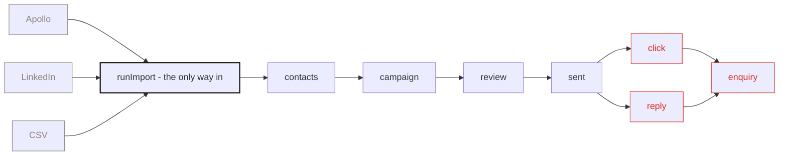
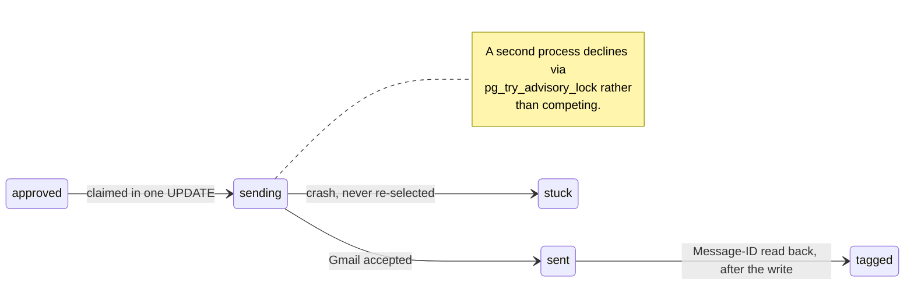

<h1 align="center">Qatalyst</h1>

<p align="center">
  <em>How we write to people one at a time —<br/>without ever writing to someone who asked us not to.</em>
</p>

<p align="center">
  <a href="https://github.com/Dibakar01/qatalyst/actions/workflows/ci.yml">
    </a>
  
  
  
  
</p>

---

Internal outbound tool. Holds a bounded contact list, writes a personalised line
per contact, enforces suppression before anything sends, and sends from our own
Google Workspace mailboxes at a safe rate.

Not a CRM. No stages, no pipeline, no forecasting.

**Phases 1–3 are built.** Phase 4 — reply and bounce ingestion, plus the
Mailchimp handoff for opted-in contacts — is not; it needs real mail flowing
first.

> [!IMPORTANT]
> **Sending is a dry run** until `GOOGLE_SERVICE_ACCOUNT_JSON` is set — the app records
> exactly what it would have sent and never contacts Google. That is a safety property,
> not an unfinished feature.
>
> **Two commands truncate tables**: `npm run test:acceptance` and `npm run verify`.
> They refuse anything but a disposable database by name — but never point them at
> `qatalyst`. Use `qatalyst_scratch`. See [Checks](#checks).

## The shape of the thing

A **campaign** is the unit of work, and the app is organised around it:

```
Contacts ──▶ Campaign ──▶ Review ──▶ Send
  import      write one     approve    from our
  + verify    message       each one   own mailboxes
```

It is one screen, and it is a desk rather than a set of pages. A lit stage, and
on that stage exactly one object: **the letter**, in three dimensions, which
you can pick up and turn over.

The letter is not decoration. How far its flap is open and how far the sheet has
come out of it is how far the work has actually got — sealed means nothing has
gone, half out means the run is half done — so the state of a campaign is the
first thing you see and you never have to read a number to know it. It is drawn
in about 250 lines of raw WebGL2 (`app/letter.tsx`, matrices in `lib/mat4.ts`);
a scene-graph library would be several hundred kilobytes to draw a box, a
triangle and a plane.

The letters stand in a vertical stack — scroll up and down, arrow up and down,
or the scrubber on the right moves through them. Vertical on purpose: a
two-finger *horizontal* swipe on macOS is the browser's back gesture and cannot
reliably be cancelled, so sideways navigation would send you out of the app.
Going vertical sidesteps it and earns something — a vertical stack is already a
list, which is exactly what the list view shows you head-on.

Each letter carries two marks. The **stamp** says the one thing that letter
needs next and takes you to where you do it; flagged drafts outrank everything,
because that is the only state the machine cannot leave without a person
(`nextAction()` in `lib/rules.ts`, tested). The **franking bars** under the
address are a hash of the campaign id (`frankingCode()`, also tested), so two
letters never look alike — and the list draws the same bars in HTML, so a row
and the envelope on the stage are recognisably the same thing.

Opening a letter unfolds it into four steps — **Write, Who, Review, Send** — and
it opens on the step it actually needs rather than always the first. The same
`nextAction()` drives that and the stamp, so the object and its insides can
never disagree.

**Nothing scrolls.** A surface that does not fit is the wrong surface, so lists
are paged, the campaign is stepped, and the review goes one message at a time —
which is how a stack of letters actually gets signed. `overflow: hidden` on the
document makes that a rule rather than an intention: anything that overflows is
a bug you can see instead of a scrollbar you can live with.

The strip along the top is the navigation, on every surface: what you can start,
what needs you, **Letters · Contacts · Sent · Blocked**, and how the machine is.
It marks the surface you are on, so you can always get anywhere and always know
where you are. **Sent** is one place for everything that has left, across every
letter — keyed off message status rather than a boolean, so when phase 4 starts
matching replies and bounces they appear there without a new surface.

The bar along the bottom switches **Stack / List** and finds letters — typing a
name turns the stack into the list, narrowed. `⌘K` focuses it. A leading known
verb runs as a command instead:

```
new <name>   write [n]   approve   send   pause   sendnow
find <text>  contacts    import    suppress <email>   block <domain>
senders      blocked     list      letters
```

`write`, `approve`, `send` and `pause` act on the open letter and refuse to run
without one. Everything a command does is also a button on screen, and both
post to the same server action.

Two colours and nothing else: **#d92819** and **#ffffff**. With a palette that
small the meaning cannot come from hue, so it comes from weight — a filled red
button acts, a red hairline warns, red text reports, and everything settled is
plain ink. A screen with no red on it needs nothing from you, which you can
check from across the room.

Both a light and a dark room, switched in the header and remembered. The choice
is written to `<html data-theme>` by a blocking script before first paint, so
there is no flash of the wrong one; the CSS and the letter's shader both read it
from there, so they can never disagree. Type is Helvetica — already on every
machine this runs on, so there is no webfont to load and no layout shift.

## Qatalyst is a distribution system

Not a mailer. Contacts arrive from several sources, go out through a campaign,
and the funnel closes when someone writes back through the website — attributed
to the letter that caused it.



Three sources, **one** import path. There is deliberately no second route in,
because a source that skipped `runImport()` would be a source that can mail
someone who asked us to stop.

### Sources

A connector's whole job is to produce rows and say which column is which.
Everything after — deduplication, the suppression check, keeping unmapped
columns as context, refusing a malformed address — is `runImport()`, the same
code a hand-uploaded CSV goes through. There is deliberately no second import
path, because a source that skipped it would be a source that can mail someone
who asked us to stop.

| | How | Status |
|---|---|---|
| **CSV** | Upload, map the columns by hand | Works |
| **Apollo** | Add it to a letter's **Who** step, or account-wide under **Sources**. Pull on demand, or the worker pulls it daily | Enrichment works on the free plan; People Search is paid and the connector **says so** rather than returning an empty result |
| **LinkedIn** | Add a source, copy the webhook URL it shows you, point your exporter at it | Works |

Sales Navigator has **no export API**. In practice a list leaves LinkedIn
through Evaboot, PhantomBuster or Clay — each spelling the same six fields
differently, and that difference is the entire integration. `PRESETS` in
`lib/connectors.ts` is a table of header names, not a scraper: nothing here
automates a browser against LinkedIn, which is how accounts get restricted.

```sh
curl -X POST http://localhost:3000/api/ingest/evaboot \
  -H "authorization: Bearer $INGEST_SECRET" \
  -H "content-type: application/json" \
  -d '[{"First Name":"Ada","Email":"ada@example.com","Company":"Analytical"}]'
```

Enrichment lives on the Contacts panel — it fills in what Apollo knows about
addresses still marked `unverified`, including the status that decides whether
they may ever be sent to. Deliberately not `runImport()`: those contacts already
exist, so an import would report them all as duplicates and change nothing.

`npm run send` works the queue *and* pulls any source that has not run today.
One process, no scheduler, no new dependency.

### The inbound end

Put `{{link}}` in a letter's body and it becomes a tracked hop:

```
  {{link}} → /r/:token → records a click → /enquire?t=… → an enquiry
```

The token is the same HMAC scheme as unsubscribe — `base64url(payload).hmac`,
nothing stored — carrying the contact and campaign, which resolve to exactly
one message because `(campaign_id, contact_id)` is unique. An unsubscribe token
cannot be replayed as a tracked link, and vice versa; both are tested.

`/u/:token`, `/r/:token`, `/enquire`, `/qt.js` and `/api/collect` are the
**entire** public surface. On the `PUBLIC_ONLY=1` deployment everything else —
including the ingest door, which writes contacts — returns 404.

The last two are the pixel, and they change what the public deployment holds:
it now records visitor events, not only unsubscribes and enquiries. `/api/collect`
is authenticated by an `Origin` allowlist rather than a secret, because a secret
shipped to a browser is not a secret — the browser sets that header and page
script cannot forge it. An unset `SITE_ORIGINS` allows nobody, so a missed
deployment step fails closed.

A first-party identifier that names a specific person is ePrivacy territory for
EU and UK visitors. "Only for people who clicked our own link" is a
legitimate-interest argument, not an exemption — say so in the privacy notice
before this ships.

## Writing a letter

Three questions, not a blank template. What kind of message — first time, no
answer yet, or long time, because those are three different emails rather than
three wordings of one. What you actually know about these people, shown as the
**share of the list that has each field**, so a template cannot quietly lean on
something 40% of them lack. And the one thing you are asking for.

That is enough to assemble the subject, the body and the model's instruction.
The shapes and the checks are in `lib/compose.ts` and come from published
cold-email guidance rather than taste: one ask, a subject about them rather than
the product, roughly a hundred words, no link in a first touch, and none of the
openings that announce a template (`I hope this finds you well`, `just following
up`, `quick question`).

The checks split into **stop** and **warn**, and the split is the point: a
missing `{{personalised}}` is structural and blocks, tired phrasing is advice
and never does. A checker that blocks on advice gets ignored.

<details>
<summary><b>Sending from several domains</b> — how volume splits, and why one burning does not stop the rest</summary>

<br/>

Cold outbound spreads across domains so the primary one survives: volume splits
between them, each warms on its own clock, and one burning does not stop the
rest.

**Warm-up is automatic**, which is the only reason spreading actually helps.
Warming by hand means editing a cap every morning for three weeks, which nobody
does — so the ramp is a function of the domain's age instead: about five a day
on day one, climbing to the configured cap over three weeks. It can only ever
*lower* a cap, never raise one, so a mailbox deliberately set to 3/day stays
there. `warmupCap()` in `lib/rules.ts`, tested.

```
day  0 │ █████                               5/day
day  7 │ █████████                           9/day
day 14 │ ██████████████████                  18/day
day 21 │ ███████████████████████████████████ 35/day
```

**Keys never touch the database.** Domain-wide delegation is per Workspace, so
each domain names an environment variable — `qalakaar.com` reads
`GOOGLE_SA_QALAKAAR_COM` — and the database stores only that name. The Sending
screen shows which variable each domain wants and whether it was found. A
domain without one falls back to `GOOGLE_SERVICE_ACCOUNT_JSON`, so an existing
single-domain setup keeps working unchanged.

Pausing a domain stops every mailbox on it at once, which is the point of
grouping them.

</details>

## Control and proof

Every message is **claimed before the wire**, in one statement. That is the
difference between a crash costing you a stuck row and a crash costing you a
second copy in a prospect's inbox.



A failure *after* the wire counts as **sent**, not as a failure to retry: a
missing Message-ID costs one unmatched reply, a duplicate costs the prospect and
the domain.

The sending rules are **settings, not constants** — the sending window, the
bounce threshold and its sample minimum, the catch-all cap and the draft batch
all live in one row and are editable under **Settings**. Warming a domain wants
different numbers than running an established one.

They are **clamped, and the clamps are the point**. A bounce threshold is
bounded to 1–8%; the window cannot open before 06:00 or close after 22:00; a
window that would end before it starts is corrected rather than silently
sending nothing all day. Tuning the rules is the point, turning them off is not.
The bounds live in `LIMITS` in `lib/rules.ts`, beside the rules, and are tested.

`allowanceNow()`, `shouldHalt()` and `maySend()` still take everything as
arguments and default to today's values, so they remain pure functions testable
with no database — which is why the whole existing suite passed unchanged
through this refactor.

**Reports** answers three questions, each from an aggregate over the rows that
caused it rather than a counter kept alongside:

| | Answers |
|---|---|
| By mailbox | Is it safe to send today? Bounce rate against the live threshold, sends against cap, how close to halting |
| By source | Is what I am paying for producing anything? Contacts → sendable → sent → clicked → enquired, with the drop-off at each hop |
| By letter | Is the writing landing? **Flag rate** is a prompt-quality signal — a letter flagging 40% has a prompt that invents things — plus click and reply rate |

Plus how fast the list is being burned: suppressions only ever grow, so their
growth rate is the honest measure of whether the outreach is working or
annoying people.

## Setup

Any Postgres works — local, Railway, Neon. The driver is `postgres.js` over the
standard wire protocol, not a vendor-specific one.

```sh
brew install postgresql@17 && brew services start postgresql@17 && createdb qatalyst
cp .env.example .env      # DATABASE_URL, APP_PASSWORD, UNSUBSCRIBE_SECRET, SEND_TZ
npm install
npm run db:migrate
npm run db:seed
npm run db:demo           # optional: sample contacts so the UI has something in it
npm run dev               # http://localhost:3000
```

> [!WARNING]
> **Upgrading an existing checkout? Your `.env` will not be updated for you.**
> `SEND_TZ` is required and has no default — the workspace returns a server
> error without it, not a degraded page. `.env` is gitignored, so `git pull`
> never touches it and `cp .env.example .env` is a fresh-install step nobody
> repeats. Add it by hand:
>
> ```sh
> grep -q '^SEND_TZ=' .env || echo 'SEND_TZ=Asia/Kolkata' >> .env
> ```
>
> It must match the database session timezone (`SHOW timezone`) or the sender
> refuses to boot — that check is deliberate, see `lib/send.ts:assertDbTimezone`.

Two more credentials unlock the later phases. Without either, the app still runs
and tells you what it would have done:

| | Needed for | Without it |
|---|---|---|
| `ANTHROPIC_API_KEY`, or one `ant auth login` | Writing drafts (phase 2) | Generation fails per contact and says so |
| `GOOGLE_SERVICE_ACCOUNT_JSON` | Sending (phase 3) | Sends run as a dry run: everything happens except the Gmail call |

## How a campaign works

**1 · Message.** A subject template and a body template. The body must contain
`{{personalised}}` — that one line is all the model writes; everything around it
is fixed text you wrote. Other variables: `{{first_name}}`, `{{last_name}}`,
`{{company}}`, `{{title}}`, and `{{context.Any CSV Column}}`.

Defining exactly one slot is what makes rule 5 enforceable: the validators know
precisely which text to check.

**2 · Audience.** Contacts whose `email_status` is `verified` or `catch_all`,
not erased, not suppressed, not already written to in this campaign. One click
writes the next 25.

**3 · Review.** Every message runs both validators before it is shown:

- **Grounding** — pulls the numbers and mid-sentence proper nouns out of the
  generated line and requires each to appear in that contact's own fields or
  `context`. An invented funding round or conference is flagged.
- **Substance** — strips the contact's name, title and company plus ordinary
  filler. If nothing meaningful is left, it is mail-merge in costume, and it is
  flagged.

Flagged messages are not blocked — they need a human. The bulk approve button
only ever touches messages that passed both validators, so nothing can be waved
through in a batch.

**4 · Send.** `npm run send` runs the sender: one tick a minute, at most one
send per mailbox per tick, with the daily cap released evenly across 09:00–17:00
so a backlog can never go out as a burst.

## Checks

| Command | What it does | Touches the database |
|---|---|---|
| `npm test` | 113 pure-function checks — tokens, CSV mapping, templates, both validators, the sending rules, what the stamp asks for, the franking hash, and the letter's matrices | no |
| `npm run lint` · `npm run build` | eslint, then a production build | no |
| `npm run test:acceptance` | Phases 1–3 end to end | **truncates** |
| `npm run verify` | **PROOF.** Everything above, plus `db:seed` termination, the S1/S4/S6/S9 regressions, `docker build`, and a backup + restore dry-run | **truncates** |

> [!WARNING]
> `test:acceptance` and `verify` **truncate tables** — including `contacts`,
> `suppressions`, `mailboxes` and `campaigns`.
>
> They now refuse any database not named as disposable, because "is it local"
> was never the right question: the real database is local too. This guard exists
> because on 2026-08-17 its absence destroyed the live contact list.
>
> ```sh
> DATABASE_URL="postgresql://$(whoami)@localhost:5432/qatalyst_scratch" npm run verify
> ```

CI runs all of these against a Postgres 17 service container on every push to
`main` and every pull request. `docker build` is only ever exercised there — it
is reported as *unverifiable*, never as a pass, on a machine without Docker.

Handy while testing: `npm run db:reset` clears everything, `npm run db:demo`
refills it, and `npm run token -- someone@example.com` prints a working
unsubscribe URL.

## Hosting split

The app runs locally. The unsubscribe endpoint cannot — a link pointing at
localhost is a dead link in every email we send.

Same codebase, deployed twice against the same database:

| | env | serves |
|---|---|---|
| local | `npm run dev` | everything, behind `APP_PASSWORD` |
| public | `PUBLIC_ONLY=1` | `/u/:token` only, everything else 404s |

`PUBLIC_ONLY=1` is what keeps the contact list off the internet.
`UNSUBSCRIBE_SECRET` must be identical in both or links stop verifying.

Unsubscribe tokens are `base64url(email).hmac` — self-contained, so the public
deployment needs no token table and no session.

## Where the rules live

| Rule | Code |
|---|---|
| 1 · One suppression check, every send path | `lib/suppression.ts` — the only module that queries `suppressions`, and `lib/gmail.ts` calls it again at the wire so no future caller can route around it |
| 2 · Send eligibility by status | `lib/rules.ts` `maySend()` and `shouldHalt()` |
| 3 · Per-mailbox daily cap, spread across the day | `lib/rules.ts` `allowanceNow()` plus one send per mailbox per tick |
| 4 · Opt-out sentence and working link on every email | `lib/template.ts` `assembleBody()` — the only function that produces a sendable body. No `List-Unsubscribe` header, deliberately |
| 5 · Two validators before `approved` | `lib/validators.ts`; bulk approval in `lib/campaigns.ts` only touches unflagged messages |
| 6 · Capture `message_id_header` on every send | `lib/gmail.ts` reads it back from Gmail after sending rather than guessing |
| Idempotent import | unique indexes on `lower(email)` and `linkedin_url` + `ON CONFLICT DO NOTHING` |
| Erasure keeps the hash | `lib/contacts.ts` `eraseContact()` — suppresses before nulling |
| Unknown verification results never become sendable | `lib/csv.ts` — any unrecognised status falls back to `unverified` |

Deliberately absent **inside the email**: open-tracking pixels, link
shorteners, HTML
email, `List-Unsubscribe` headers, lead scoring, scraping.

## Before this sends for real

SPF, DKIM and DMARC on the sending domain, then a two to three week mailbox
warm-up from about five a day up to the cap. Both have lead times measured in
weeks and neither is code.

## Migrations

Every schema change gets a migration. Never edit an applied one.

```sh
npm run db:generate   # after editing db/schema.ts
npm run db:migrate
```
